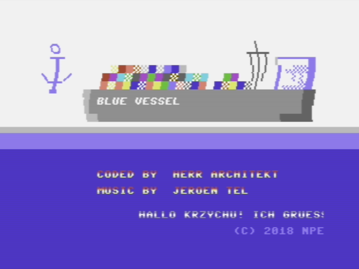
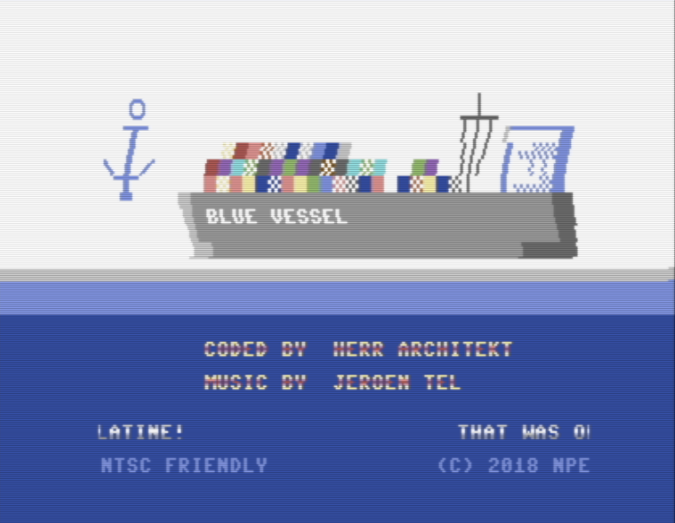

# bluevessel

[](https://travis-ci.org/maciejmalecki/bluevessel)

BlueVessel is my first official C64 intro (calling it a demo would be a bit too much) that I completed in ca 2hrs using c64lib. I plan to 
give it as an addition to C64C that I have prepared for my collegue. Why it is about vessel and why it's blue - he'll know ;-)

This intro is released in form of PRG file that can be either launched using C64 emulator (i.e. Vice) or by running on real hardware 
(preferred).

## how to compile

This intro is written with KickAssembler and can be compiled with KA version 5.0. It requires, however, a few libraries to be checked out into `<lib-dir>`:
* https://github.com/c64lib/common
* https://github.com/c64lib/chipset
* https://github.com/c64lib/text
* https://github.com/c64lib/copper64

The intro can be compiled in following way:
```
java -jar <path-to-ka>/KickAss.jar -libdir <lib-dir> bluevessel.asm
```
Put path to the place where you keep your Kick Assembler installation as `<path-to-ka>` and directory where you have cloned library repositiories as `<lib-dir>`.

Alternatively, you can always download PRG file from GitHub releases location: https://github.com/maciejmalecki/bluevessel/releases/latest

## how is it made

This intro demonstates few simple but well cycled raster based effects. Writing stable raster interrupt routines is not a big deal but it is rather annoying to code and cycle it separately for each project I'm going to develop, therefore I have written copper64 library that, in the future, will do the job for most common effects you'll need for games, intros or even simple demos.

I have managed to handle both PAL and NTSC machines (although currently it works only with 65 cycle models). The whole story is described in last chapter of this README.

Let's look at the screen:



From top to bottom we see: tech tech effect (shallow one using just scroll X register) on the "picture", then 3 color switches going across border and background, then animated font color effect (which is in fact just a raster bar with rotated color map) and finally a trivial 8px scroll with static font color effect.

Let's see how it is made in the code:
```(assembler)
// ----- "copper" list, here we define which effects should be executed at which raster line  ------
// ----- or, we also call custom IRQ handlers here such as doScroll, doCycleAndTechTech, etc. ------
.align $100
copperList:
  (1)       copperEntry(0,                            c64lib.IRQH_JSR,              <doScroll, >doScroll)
  (2)       copperEntry(24,                           c64lib.IRQH_JSR,              <doCycleAndTechTech, >doCycleAndTechTech)
  (3)       copperEntry(LOGO_LINE,                    c64lib.IRQH_HSCROLL_MAP,      <hscrollMapDef, >hscrollMapDef)
  (4)       copperEntry(COLOR_SWITCH_1,               c64lib.IRQH_BORDER_BG_0_COL,  COLOR_1, 0)
  (5)       copperEntry(COLOR_SWITCH_2,               c64lib.IRQH_BORDER_BG_0_COL,  COLOR_2, 0)
  (6)       copperEntry(COLOR_SWITCH_3,               c64lib.IRQH_BORDER_BG_0_COL,  COLOR_3, 0)
  (7)       copperEntry(CREDITS_COLOR_BARS_LINE,      c64lib.IRQH_BG_RASTER_BAR,    <colorCycleDef, >colorCycleDef)
  (8)       copperEntry(CREDITS_COLOR_BARS_LINE + 16, c64lib.IRQH_BG_RASTER_BAR,    <colorCycleDef, >colorCycleDef)
(9)hscroll: copperEntry(SCROLL_HSCROLL_LINE_START,    c64lib.IRQH_HSCROLL,          5, 0)
  (10)      copperEntry(SCROLL_COLOR_BARS_LINE,       c64lib.IRQH_BG_RASTER_BAR,    <scrollBarDef, >scrollBarDef)
  (11)      copperEntry(SCROLL_HSCROLL_LINE_END,      c64lib.IRQH_HSCROLL,          0, 0)
  (12)      copperEntry(257,                          c64lib.IRQH_JSR,              <playMusic, >playMusic)
  (13)      copperEntry(COLOR_SWITCH_4,               c64lib.IRQH_BORDER_BG_0_COL,  COLOR_4, 0)
  (14)      copperLoop()
endOfCopper:
```

First two effects are in fact invisible at the place of installation: (1) at raster `0` and (2) at raster `24` just executes code of the text scrool (that goes in the bottom of the screen) and does color and `H-SCROLL` rotating logic for font effects and tech tech. These two handlers were installed there just because it is a free place on the screen where no other visual effects are displayed and this code must go in sync with the screen, because we will get some ugly visual artefacts otherwise.

At position (3) we install tech-tech effect which is in fact a `H-SCROLL` register map which is then rotated at (2). This gives wavy effect of tech-tech.

Then, at positions (4), (5) and (6) we change screen colors. Here we use `IRQH_BORDER_BG_0_COL` handler which is carefully cycled so that it looks that we don't have a border at all (I know, a bit lame...)

At positions (7) and (8) we use raster bar for the first time. Color map for this bar is additionally cycled at step (2) which gives nice intro-like font effect. The whole mystery is to print text using reverse mode and use BG_0 register for color cycling.

Then there is a very lame scroll procedure with starts with `H-SCROLL` initialization at step (9), then another, this time static raster bar at step (10) for another font color and then `H-SCROLL` restore at step (11). Note label `hscroll:` in step (9) - it will be used to modify handler parameter (see value `5` just after `c64lib.IRQH_HSCROLL`). The modification is performed in step (1).

We then play music at step (12) and yet another time switch background color (13) so that we have upper screen white and lower screen blue.

There are still plenty of work on https://github.com/c64lib/copper64 and I cannot guarantee its API stability but there are a bit more handlers already available. Go there and see if you're interested.

# short story of NTSC support

Inspired with "NTSC Commodore Users Group for North America/Japan" FB group I was wondering how easy would it be to add support to NTSC models. There were at least two challenges with this: firstly, code of copper64 is carefully cycled so no ugly mid-line effects are visible. Secondly, there are less raster lines available in NTSC which means we will have less cycles to execute the code of the intro per single frame. And I knew that frame is currently packed with code with extra overhead of copper64 it might be difficult to fit everything without any optimization.

So, I took my intro and run on Vice with `-ntsc` parameter set and, no surprise, the code didn't run. It displayed the screen and get stuck. The answer was really trivial - when I looked at my "copper list", some of the last entries were hooked to the raster numbers that simply don't exist on NTSC machines.

I started to shuffle with copper list so that I can fit everything within raster numbers that are legal for both models (that was really easy due to copper64! - you just need to exchange lines on the copper list and play with raster numbers). Then I discovered that I don't have enough time to fit it all in (no surprise, again). Because I wanted to preserve all effects, I started to optimize the code. I wrote optimized, "unlooped" version of memory rotation routine, I also "unlooped" my scrolling routine and it was just it. Now my code worked on both models!

There were still two issues left. First I discovered that 0-eth raster line on NTSC model is located on the bottom of the screen. Even worse, it is located in visible area, not in V-BLANK section of the display time. This was a problem, because I wanted my intro to have top halve of the screen being white and bottom part being blue. As a solution I had to use NTSC detection code (taken from J0X code, see [here](http://codebase64.org/doku.php?id=base:detect_pal_ntsc)) and dynamically change raster line of the first color switch right in the copper list.

Second issue is probably related to the fault in my color raster bar routine that I managed to quickly mask so it does not show up (I will correct that later).

So, now enjoy the results:



There are still two problems! The intro does not work with `-ntscold` switch (that is the old version of NTSC, the one with 64 cycles per line). I discovered that the problem is in music routine, I need more time to debug it. Second problem is visible only on WinVice 3.x (older Linux version that I use normally does not show it) - there is half-cycle visual problem at the end of color-switched lines. No surprise, because code is cycled for 63 cycles per line, now run on 65 cycles per line, and some code is just executed too early. This problem can be probably easily solved with different assembling targets (separate binaries for PAL and NTSC), as it just a matter of single `NOP` added somewhere. For elegant, single binary solution - I have to think more. Maybe I will just create a separate handler just for these "difficult" cases such as changing of border and background color at the (almost) same time.

